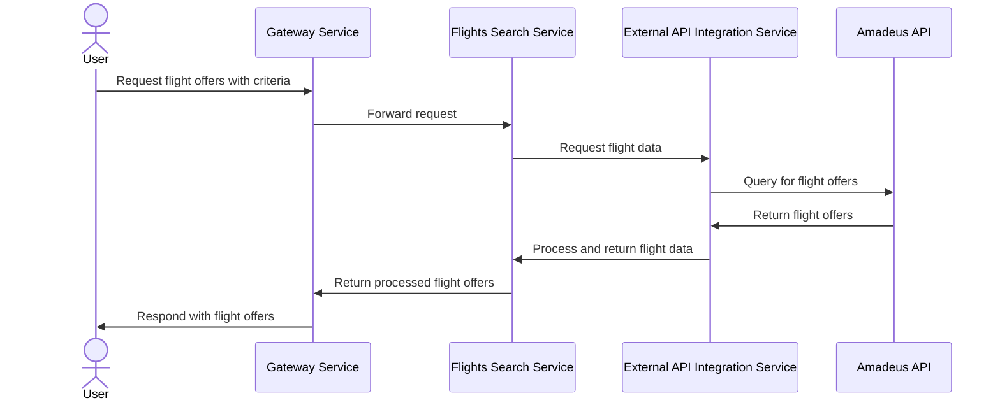
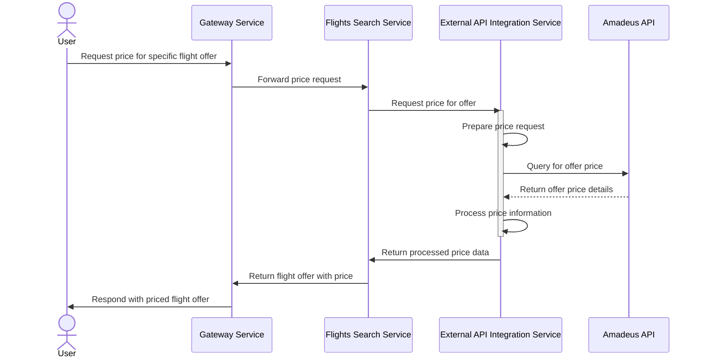
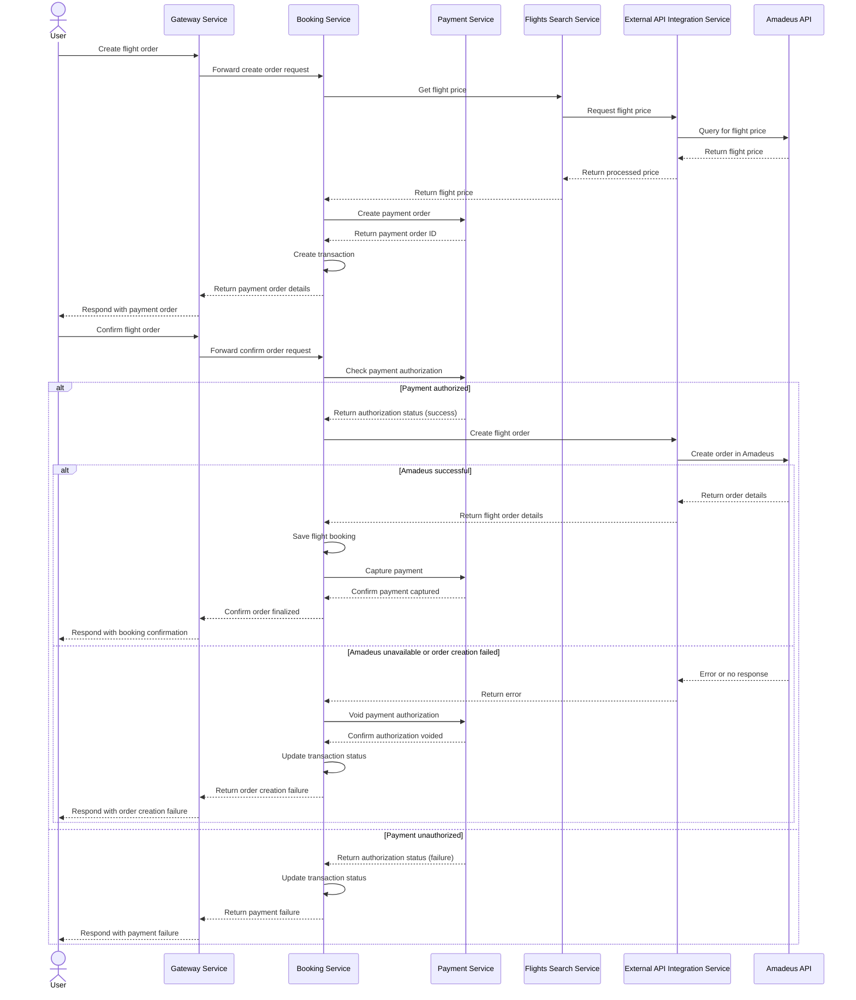

# Travel App

## Overview

This project is a comprehensive travel application built using a Modular-monolith architecture. It provides functionalities for flight and hotel searches, bookings, payments, user management, and more. The application is designed to be scalable, maintainable, and efficient in handling various aspects of travel planning and management.

## Features

### 1. Flight Search and Booking

The flight search and booking feature allows users to search for available flights and make bookings. This process involves multiple steps and services working together.

#### Flight Search Process



1. The user sends a request to the gateway-service with flight search criteria.
2. The gateway-service forwards the request to the flights-search-service.
3. The flights-search-service requests flight data from the external-api-integration service.
4. The external-api-integration service queries the Amadeus API for flight offers based on the given criteria.
5. Amadeus API returns the flight offers to the external-api-integration service.
6. The external-api-integration service processes the data and returns it to the flights-search-service.
7. The flights-search-service sends the processed flight offers back to the gateway-service.
8. Finally, the gateway-service responds to the user with the flight offers.

#### Flight Pricing Process



1. The user sends a request to the gateway-service for the price of a specific flight offer.
2. The gateway-service forwards this request to the flights-search-service.
3. The flights-search-service requests the price data from the external-api-integration service.
4. The external-api-integration service prepares the price request (this might involve formatting the offer details correctly for the Amadeus API).
5. The external-api-integration service queries the Amadeus API for the specific offer price.
6. Amadeus API returns the offer price details.
7. The external-api-integration service processes the received price information.
8. The processed price data is sent back to the flights-search-service.
9. The flights-search-service returns the flight offer with the price to the gateway-service.
10. Finally, the gateway-service responds to the user with the priced flight offer.

#### Flight Booking Process



1. The initial flow for creating a flight order, including getting the flight price from Amadeus through the flight search and external API integration services.
2. Creating a payment order based on the retrieved price.
3. When the user confirms the flight order, the booking-service checks the payment authorization with the payment-service.
4. If the payment is authorized (success path):
   - The booking-service attempts to create the flight order through the external-api-integration service.
   - If Amadeus successfully creates the order:
     - The process continues, saving the booking and capturing the payment.
   - If Amadeus is unavailable or fails to create the order:
     - The booking-service voids the payment authorization.
     - The transaction status is updated to reflect the failure.
     - The user is informed about the order creation failure.
5. If the payment is unauthorized (failure path):
   - The transaction status is updated to reflect the failed payment.
   - The user is informed about the payment failure.

### 2. Hotel Search and Booking

The hotel search and booking feature allows users to find and book accommodations. This process is similar to flight booking but tailored for hotel reservations.

### 3. User Authentication and Management

This feature handles user registration, login, and profile management. It ensures secure access to the application and personalized experiences for users.

### 4. Payment Processing

The payment processing feature securely handles financial transactions for flight and hotel bookings. It integrates with external payment gateways to process payments and manage refunds when necessary.

### 5. External API Integration

This feature allows the application to communicate with external services like Amadeus for flight and hotel data. It handles API requests, data transformation, and error handling.

### 6. Logging and Monitoring

The logging and monitoring feature tracks application performance, user activities, and system errors. It uses the ELK (Elasticsearch, Logstash, Kibana) stack for comprehensive logging and visualization.

### 7. Auditing

The auditing feature keeps track of important system events and user actions for security and compliance purposes. It maintains a detailed audit trail of all significant operations within the system.

### 8. Notifications

The notifications feature keeps users informed about their bookings, payments, and other relevant information. It can send notifications through various channels such as email, SMS, or push notifications.

## Technology Stack

- Node.js
- NestJS
- PostgreSQL
- Sequelize ORM
- Docker
- pnpm (Package Manager)
- Elasticsearch, Logstash, and Kibana (ELK Stack) for logging and monitoring

## Project Structure

The project follows a monorepo structure using NestJS for microservices. Here's an overview of the main components:

- `apps/`: Contains all services
  - `gateway-service/`: API Gateway
  - `flights-search-service/`: Handles flight search operations
  - `hotels-search-service/`: Manages hotel search functionality
  - `booking-service/`: Handles booking operations
  - `users-service/`: Manages user-related operations
  - `payments-service/`: Handles payment processing
  - `notifications-service/`: Manages notifications
  - `authentication-service/`: Handles user authentication
  - `auditing-service/`: Manages auditing operations
  - `external-api-integration-service/`: Integrates with external APIs
  - `logging-and-monitoring-service/`: Handles logging and monitoring
- `libs/`: Shared libraries
  - `database/`: Database configurations and models
  - `core/`: Core functionalities and shared utilities

## Setup and Installation

1. Clone the repository:
   ```
   git clone https://github.com/ahmdhusam/travel-app
   cd travel-app
   ```

2. Install dependencies:
   ```
   pnpm install
   ```

3. Set up environment variables:
   - Copy `.env.example` to `.env` and fill in the necessary values.

4. Start the services:
   ```
   pnpm run start:dev
   ```

## Running with Docker

1. Build the Docker images:
   ```
   docker-compose build
   ```

2. Start the services:
   ```
   docker-compose up
   ```

## Data Model

The application uses Sequelize as an ORM. Here's a brief overview of some key models:

- User
- Flight
- Hotel
- Booking
- Payment
- Notification

For detailed model structures, refer to the files in `apps/**/src/models/`.

## API Documentation

API documentation is generated using Swagger. After starting the application, you can access the Swagger UI at:

```
http://localhost:3000/api/v1/docs
```

## Testing

To run tests:

```
pnpm test
```

For end-to-end tests:

```
pnpm test:e2e
```

## License

This project is licensed under the MIT License - see the [LICENSE](LICENSE) file for details.